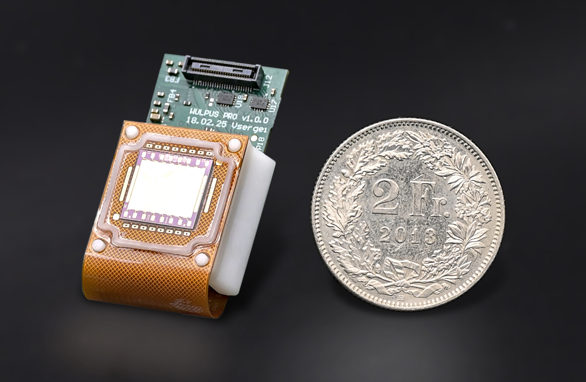
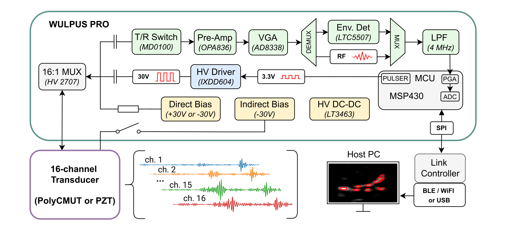
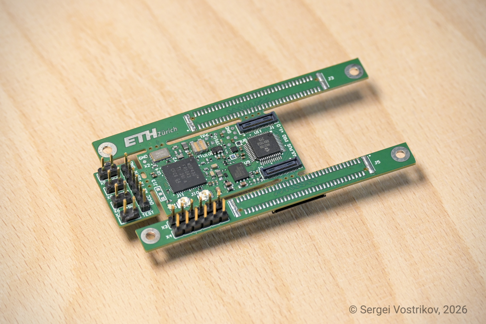
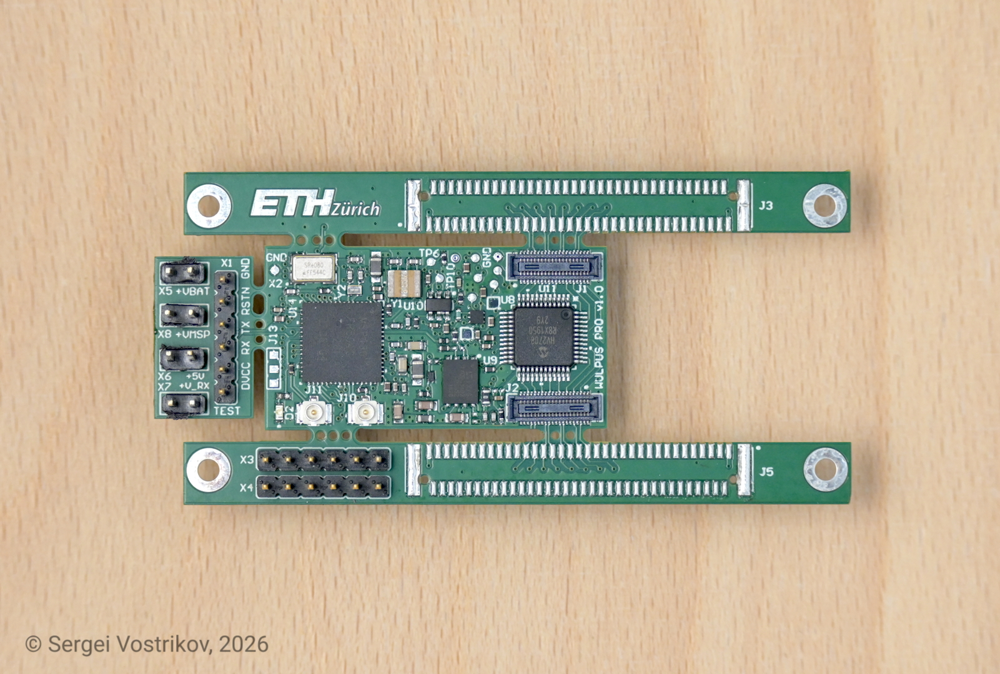
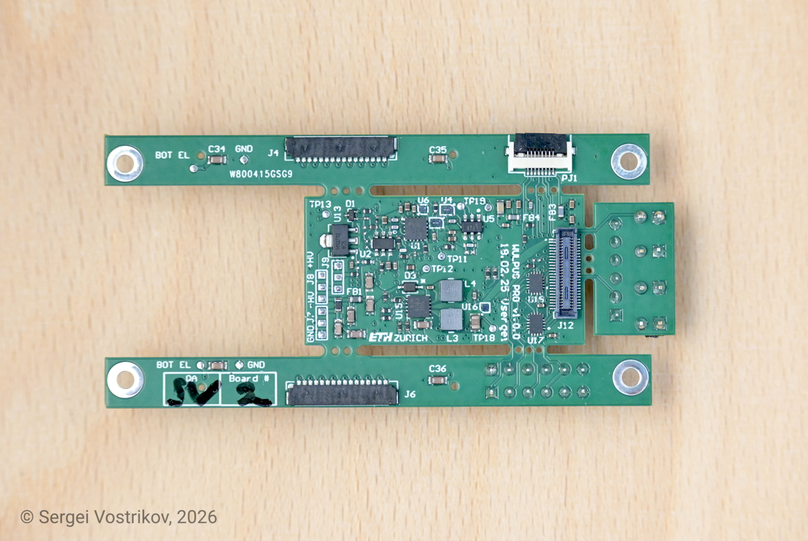

# WULPUS PRO
## A base platform for wearable ultra-low-power ultrasound
> Independent fork by @Sergio5714 (Sergei Vostrikov)

<p align="center">
  
  <br/>
  WULPUS PRO module with PolyCMUT transducer.
</p>

## Table of contents

- [Introduction](#introduction)
  - [System diagram](#system-diagram)
  - [Hardware photos](#hardware-photos)
  - [Specifications](#specifications)
- [Structure of the repository](#structure-of-the-repository)
- [Documentation](#documentation)
- [Build Instructions](#build-instructions)
  - [PCBWay shared projects for WULPUS PCBs](#pcbway-shared-projects-for-wulpus-pcbs)
- [Usage](#usage)
  - [Wi-Fi setup: WULPUS PRO + XIAO ESP32-C6](#wi-fi-setup-wulpus-pro--xiao-esp32-c6)
  - [BLE setup: WULPUS PRO + nRF52 DK (legacy)](#ble-setup-wulpus-pro--nrf52-dk-legacy)
- [Citation](#citation)
- [Changelog](#changelog)
- [Authors](#authors)
- [License](#license)
  - [Limitation of Liability](#limitation-of-liability)

# Introduction

This repository contains the work in progress on the WULPUS PRO ultrasound platform, a successor of the [WULPUS Project](https://github.com/Sergio5714/wulpus). It features +30V unipolar programmable pulser, time-multiplexed multichannel acquisition frontend with TGC, optonal envelope extractor and support of PZTs and CMUTs. The module is compact (40 x 20 mm footprint) and lightweight (5g), allowing integration with external host PCB.

## System diagram

<p align="center">
  
  <br/>
  WULPUS PRO system diagram
</p>

## Hardware photos

<table>
  <tr>
    <td colspan="2" align="center">
      
      <br/>
      WULPUS PRO evaluation board
    </td>
  </tr>
  <tr>
    <td width="50%" align="center">
      
      <br/>
      Top view
    </td>
    <td width="50%" align="center">
      
      <br/>
      Bottom view
    </td>
  </tr>
</table>

## Specifications

WULPUS PRO builds on the original [WULPUS](https://github.com/Sergio5714/wulpus) platform and keeps the same low-power wearable ultrasound philosophy while extending the hardware and communication options. The table below compares the main features of WULPUS PRO with those of the original WULPUS platform.

| Feature | WULPUS | WULPUS PRO |
| --- | --- | --- |
| Number of channels | 8, time-multiplexed | **16**, time-multiplexed |
| Supported transducers | PZT transducers | PZT transducers, **CMUTs** |
| Excitation amplitude | 15 V unipolar | **30 V** unipolar |
| Excitation frequency | ~100 kHz to 4 MHz | ~100 kHz to **10 MHz** |
| Transducer biasing | - | Indirect or direct **bias**, **-30 V or 30 V** |
| Analog front-end | 10 dB LNA + 30.8 dB PGA | 6 dB LNA + **70 dB VGA** |
| TGC support | No (fixed gain) | **Yes** (linear profile) |
| Maximum PRF | 50 Hz | **300 Hz** |
| Power budget at 50 Hz PRF | <=25 mW | <=40 mW |
| Wireless link | BLE | BLE or **Wi-Fi** (via host) |
| Form factor | 46 x 25 mm footprint | **40 x 20 mm** footprint |

Full WULPUS PRO specifications are available in [docs/full_specifications.md](docs/full_specifications.md).

# Structure of the repository

This repository has the following folders:

- `hw`, containing the CAD source files for:
  - WULPUS PRO acquisition PCB, located at `hw/wulpus_pro_acq_pcb_dev_board`
  - optional WULPUS adapter PCB for polyCMUT transducers, located at `hw/wulpus_polycmut_adapter`; this board was developed for research purposes
- `fw`, containing the firmware source code, namely:
  - MSP430 ultrasound MCU firmware required for the WULPUS PRO module, located at `fw/msp430`
  - ESP32 Wi-Fi firmware for the Seeed Studio XIAO ESP32-C6, located at `fw/esp32`
  - nRF52 firmware, located at `fw/nrf52`:
    - nRF52832 DK board firmware, located at `fw/nrf52/ble_peripheral/US_probe_nRF52_firmware`
    - nRF52840 USB dongle firmware, located at `fw/nrf52/peripheral/US_probe_dongle_firmware`
- `sw`, containing the Python code for the WULPUS PRO API and graphical user interface
- `docs`, containing project-level documentation such as the full WULPUS PRO specifications

# Documentation

WULPUS PRO builds on top of the original WULPUS platform. Please refer to the original [WULPUS User Manual](https://github.com/Sergio5714/wulpus/blob/main/docs/wulpus_user_manual.pdf) for assembly instructions, example measurements, and GUI overview.

For WULPUS PRO-specific documentation, see:

- [Full specifications](docs/full_specifications.md)
- [Hardware README](hw/README.md)
- [MSP430 firmware README](fw/msp430/README.md)
- [ESP32 Wi-Fi firmware README](fw/esp32/README.md)
- [nRF52 BLE firmware README](fw/nrf52/README.md)
- [Software README](sw/README.md)

# Build Instructions

To build your own instance of the WULPUS PRO platform, complete the following steps:

1. *PCB manufacturing and assembly*<br>
   Use the design files, schematics, and bills of materials under the `hw` folder. The WULPUS PRO acquisition PCB is required. The polyCMUT adapter PCB is optional and intended for research setups using polyCMUT transducers.

2. *Flash the required MSP430 firmware*<br>
   The MSP430 ultrasound MCU firmware is required for the WULPUS PRO module. Follow the instructions in `fw/msp430` to set up the toolchain, compile the firmware, and flash the MSP430 MCU.

3. *Prepare a host system*<br>
   Choose one of the supported host interfaces:

   - ESP32-based Wi-Fi host, for example the Seeed Studio XIAO ESP32-C6. Follow the instructions in [fw/esp32/README.md](fw/esp32/README.md) to build and flash the ESP32 firmware. After flashing, complete the provisioning step so WULPUS PRO can connect to your Wi-Fi network.
   - nRF52 BLE host, using the nRF52832 DK board and nRF52840 USB dongle. This is the legacy BLE setup. Follow the instructions in [fw/nrf52/README.md](fw/nrf52/README.md) to compile and flash both firmwares.

4. *Python dependencies installation on the host PC*<br>
   Follow the instructions in `sw` to install the Python dependencies. With `uv`, the basic setup is:

   ```bash
   uv sync
   uv run jupyter notebook
   ```

## PCBWay shared projects for WULPUS PCBs

For convenient one-click PCB production and assembly, you can use the PCBWay shared projects (optional; DIY via the `hw` folder is also supported):
- [WULPUS PRO Evaluation Board v1.0.0](https://www.pcbway.com/project/shareproject/WULPUS_PRO_Evaluation_board_v1_0_0_992d7510.html)

This option is convenient for outsourced PCB production and assembly, with an estimated **~1 month lead time** and a price of about **USD 220** per probe (evaluation board), based on mid-2026 pricing.

# Usage

## Wi-Fi setup: WULPUS PRO + XIAO ESP32-C6

1. Connect the ESP32 host module to the WULPUS PRO board using the pin mapping documented in [fw/esp32/README.md](fw/esp32/README.md).
2. Power the ESP32-based host module, for example the Seeed Studio XIAO ESP32-C6 running the firmware from `fw/esp32`.
3. Power the WULPUS PRO board through the connector or debug pin headers.
4. Start Jupyter from the `sw` folder:

   ```bash
   uv run jupyter notebook
   ```

5. Open `wulpus_pro_wifi_example.ipynb` in the browser and follow the notebook instructions for discovery, connection setup, configuration transfer, and acquisition.

## BLE setup: WULPUS PRO + nRF52 DK (legacy)

1. Connect the nRF52 DK to the WULPUS PRO board using the pin mapping documented in [fw/nrf52/README.md](fw/nrf52/README.md).
2. Plug in the USB dongle and power the nRF52 DK via USB.
3. Check the dongle connection. The green LED should light up. If it does not, press the reset button on the nRF52 DK and try again.
4. After confirming dongle connectivity, power the WULPUS PRO board through the connector or debug pin headers.
5. Start Jupyter from the `sw` folder:

   ```bash
   uv run jupyter notebook
   ```

6. Open `wulpus_pro_gui.ipynb` in the browser and follow the notebook instructions to begin acquisition.

# Citation

Please cite our [arXiv preprint](https://arxiv.org/abs/2607.12137):

```bibtex
@article{vostrikov2026wulpuspro,
  title={WULPUS PRO: Multi-mode Ultra-Low-Power Wearable Ultrasound and Array Imaging with CMUT Support},
  author={Vostrikov, Sergei and Villani, Federico and Hirschi, Cedric and Lu, Jinhao and Welsch, Jonas and Angerer, Martin and Cretu, Edmond and Rohling, Robert and Cossettini, Andrea and Benini, Luca},
  journal={arXiv preprint arXiv:2607.12137},
  year={2026},
  url={https://arxiv.org/abs/2607.12137}
}
```

If you would like to cite this repository, please use:

```bibtex
@misc{wulpus_pro_repo_sergio5714_2026,
  title={WULPUS PRO: A Base Platform for Wearable Ultra-Low-Power Ultrasound (Independent Fork)},
  author={Vostrikov, Sergei and Villani, Federico and Hirschi, Cedric and Cossettini, Andrea and Benini, Luca},
  year={2026},
  howpublished={GitHub repository},
  url={https://github.com/Sergio5714/wulpus-pro}
}
```

# Changelog

See [CHANGELOG.md](CHANGELOG.md) for release notes and main project changes.

# Authors

This fork is maintained independently by @Sergio5714 ([Sergei Vostrikov](https://scholar.google.com/citations?user=a0KNUooAAAAJ&hl=en)).

The WULPUS PRO system was originally developed at the [Integrated Systems Laboratory (IIS)](https://iis.ee.ethz.ch/) at ETH Zurich by:

- [Sergei Vostrikov](https://scholar.google.com/citations?user=a0KNUooAAAAJ&hl=en) (PCB design, firmware, software, open-sourcing)
- [Federico Villani](https://scholar.google.com/citations?user=5LgLMCEAAAAJ&hl=en) (PCB design, component selection)
- [Cedric Hirschi](https://www.linkedin.com/in/c%C3%A9dric-cyril-hirschi-09624021b/) (firmware, software)
- [Andrea Cossettini](https://scholar.google.com/citations?user=d8O91jIAAAAJ&hl=en) (supervision, project administration)
- [Luca Benini](https://scholar.google.com/citations?hl=en&user=8riq3sYAAAAJ) (supervision, project administration)

Thanks to all the people who contributed to the WULPUS PRO platform:

- [Sebastian Frey](https://scholar.google.com/citations?user=7jhiqz4AAAAJ&hl=en) (design review)

# License

The following files are released under Apache License 2.0 (`Apache-2.0`) (see `sw/LICENSE`):

- `sw/`

The following files are released under Solderpad v0.51 (`SHL-0.51`) (see `hw/LICENSE`):

- `hw/`

The `fw/msp430/`, `fw/nrf52/`, and `fw/esp32/` directories contain third-party sources that come with their own licenses. See the respective folders and source files for the licenses used.

## Limitation of Liability

In no event and under no legal theory, whether in tort (including negligence), contract, or otherwise, unless required by applicable law (such as deliberate and grossly negligent acts) or agreed to in writing, shall any Contributor be liable to You for damages, including any direct, indirect, special, incidental, or consequential damages of any character arising as a result of this License or out of the use or inability to use the Work (including but not limited to damages for loss of goodwill, work stoppage, computer failure or malfunction, or any and all other commercial damages or losses), even if such Contributor has been advised of the possibility of such damages.
