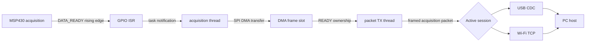
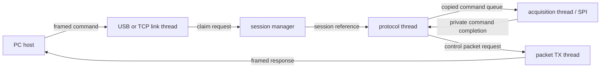
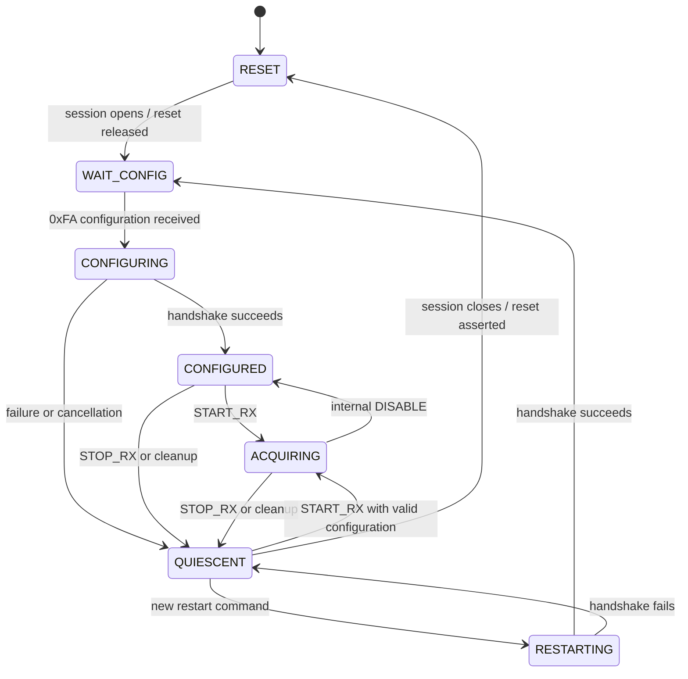
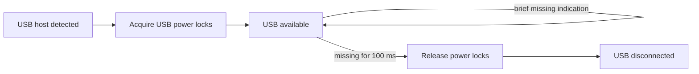

# Firmware architecture

The ESP32 firmware bridges a WULPUS PRO Acquisition PCB to one PC host over
either native USB CDC or Wi-Fi/TCP. Transport selection is dynamic: USB and TCP
listen concurrently, but only one valid protocol session can control the board
at a time.

## Contents

- [Component layout](#component-layout)
- [Application threads](#application-threads)
- [Acquisition data path](#acquisition-data-path)
- [Control path](#control-path)
- [USB and Wi-Fi session switching](#usb-and-wi-fi-session-switching)
- [Acquisition state machine and MSP430 handshake](#acquisition-state-machine-and-msp430-handshake)
- [USB power management](#usb-power-management)

## Component layout

| Path | Responsibility |
|---|---|
| `main/app_main.c` | Initialize components and start application threads. |
| `components/bsp` | Initialize the XIAO board and control its status LED. |
| `components/board` | Board GPIO, MSP430 reset, DATA_READY interrupt, SPI DMA, and USB light-sleep lock. |
| `components/frames` | Fixed pool of DMA-capable acquisition buffers. |
| `components/control` | Active session, acquisition state, sticky errors, and diagnostic counters. |
| `components/protocol` | PC protocol headers, commands, validation, and status structures. |
| `components/links` | Common ordered byte-stream interface plus USB and TCP adapters. |
| `components/sock` | TCP socket creation, listening, transfer, and synchronization. |
| `components/threads` | Long-running acquisition, protocol, transport, transmission, and provisioning tasks. |
| `components/provisioner` | Wi-Fi station setup and SoftAP provisioning workflow. |
| `components/persistent_config` | Versioned device-wide boot policy stored in NVS. |
| `components/mdns_manager` | Network discovery for the TCP service. |
| `components/msp430_programmer` | Image staging, validation, boot-time four-wire JTAG programming, and persisted update results/diagnostics. |

Acquisition GPIO/SPI operations stay in `components/board`; application threads
do not manipulate those peripherals directly. The MSP430 programmer owns its
configured TEST and JTAG GPIOs while programming.

## Application threads

| Thread | Default priority | Role |
|---|---:|---|
| `acquisition` | 8 | Sole acquisition SPI and MSP430 handshake owner. Executes queued commands and receives frames. |
| `protocol` | 6 | Sole reader of the active link. Parses PC commands and orchestrates the MSP430 lifecycle. |
| `usb_link` | 5 | Detects a USB host, finds a valid protocol header, and attempts to claim the session. |
| `tcp_link` | 5 | Starts once, waits for a Wi-Fi connection, then accepts TCP clients and attempts to claim the session. |
| `provisioning` | 5 | Persistent Wi-Fi owner. Applies boot policy, provisions or reconnects, publishes connectivity, and configures power save/TWT. |
| `packet_tx` | 4 | Sole writer to USB or TCP. Serializes control responses and acquisition packets. |

`app_main()` performs initialization and starts these threads. It does not move
acquisition data.

Before normal threads start, `app_main()` checks for a committed MSP430 update
and runs it synchronously. Uploads arrive through the normal protocol task;
commit persists the request and creates a short-lived `msp430_reboot` task to
restart the ESP32 after 250 ms. USB/TCP application commands are unavailable
during the subsequent boot-time programming. Results and JTAG diagnostics are
stored in NVS for retrieval after normal startup. See
[MSP430 updates](msp430_update_guide.md) for the lifecycle and recovery limits.

## Acquisition data path



SPI DMA writes each complete acquisition payload directly into a frame slot.
The payload is not copied between the acquisition and packet-TX threads.

The default frame pool contains 64 slots. At 500 frames/s it holds 128 ms of
data and consumes 51,456 bytes for payload storage, plus small metadata and
allocator overhead. Slots move through these ownership states:

```text
FREE -> SPI -> READY -> TX -> FREE
```

If no free slot becomes available within 100 ms, acquisition stops and the
sticky `ACQ_BUFFER_OVERFLOW` status flag and overflow counter are set. Completed
frames still queued when the session is stopped are released and counted as
discarded frames.

## Control path



The protocol thread is the only active-link reader. The packet-TX thread is the
only writer, preventing control headers and RF payloads from interleaving. It
drains pending control responses before sending another ready acquisition
frame; an in-progress packet is never interrupted.

## USB and Wi-Fi session switching

USB and TCP listeners do not claim ownership merely because a cable is attached
or a socket connects. A listener waits for a valid protocol frame before it
attempts to claim the global session.

The first valid frame wins. A competing transport receives `BUSY`, and it does
not gain access to acquisition data.

To switch transports cleanly:

1. Stop acquisition on the current transport.
2. Send `CLOSE`.
3. Wait for its acknowledgement and allow the ESP32 to return the MSP430 to its
   safe configuration state.
4. Connect with the other transport and send its first command.

The USB cable may remain physically connected when switching to Wi-Fi. An idle
USB connection does not own the protocol session. If the USB application still
has an active session, a TCP client receives `BUSY` until USB closes or fails.

Session references include a generation counter. Queued frames from an older
session are rejected after ownership changes, preventing stale data from being
sent to the new host.

## Acquisition state machine and MSP430 handshake

The acquisition task is the only owner of MSP430 reset, DATA_READY, and
acquisition SPI. The protocol thread queues MSP430 commands to the acquisition
task and waits for their result before sending a success or error response to
the PC host.



The main transitions are:

| Event | Result |
|---|---|
| Session opens | Reset the MSP430 for 10 ms, then wait for its configuration request. |
| `SET_ACQ_CONFIG` (`0xFA`) | Wait for DATA_READY, send the 804-byte configuration, and confirm DATA_READY returns low. |
| `START_RX` | Publish any frame received just before START, then publish subsequent frames normally. |
| Internal `DISABLE` | Stop publication; at most one completed frame may remain private. This is not a PC protocol command. |
| `STOP_RX` | Finish any active SPI transfer, stop acquisition, and discard private and queued frames. |
| Restart (`0xFB`) | Send the restart block and wait for the next configuration-request assertion. |
| Session closes or fails | Quiesce, restart if needed, assert reset, and release session ownership. |

`QUIESCENT` is a stable stopped state of the acquisition task. With a valid
configuration, `START_RX` can resume acquisition directly. A restart instead
sends the `0xFB` block, waits for the MSP430's next configuration request, and
then changes the state to `WAIT_CONFIG`. A failed restart returns to
`QUIESCENT` without retrying automatically. Session cleanup proceeds to
`RESET`; otherwise, another restart attempt requires a new command.

DATA_READY notifications only wake the task. The GPIO level and a rising-edge
counter determine whether an assertion is new, so a signal held high cannot
start duplicate transfers. A rising edge also proves that a short low pulse
occurred when the pulse was too brief to observe directly.

Each queued command has its own completion result and session reference. Timed
out or stale-session commands are cancelled without affecting later commands.
An SPI transfer already in progress is allowed to finish safely. Handshake waits
time out after two seconds; the complete queued command has an eight-second
limit.

The acquisition implementation is split by responsibility:

| File | Responsibility |
|---|---|
| `acquisition_thread.c` | Command queue, state transitions, scheduling loop, and task lifecycle. |
| `acquisition_handshake.c` | DATA_READY ISR, edge tracking, handshake waits, and MSP430 restart transfer. |
| `acquisition_frames.c` | SPI frame reception, pending-frame ownership, publication, and cleanup. |
| `acquisition_internal.h` | Private state and interfaces shared by those files. |

The legacy GUI sequence `STOP_RX -> SET_ACQ_CONFIG(0xFB) ->
SET_ACQ_CONFIG(0xFA) -> START_RX` remains supported.

Host regression tests and the physical-board verification matrix are documented
in [acquisition tests](../tests/acquisition/README.md).

## USB power management

The native USB CDC link uses the ESP32-C6 USB Serial/JTAG peripheral. Power
management follows physical USB presence, independently of protocol session
ownership.



| Mechanism | Purpose |
|---|---|
| `ESP_PM_NO_LIGHT_SLEEP` | Prevent light sleep from interrupting USB CDC. |
| `ESP_PM_CPU_FREQ_MAX` | Keep USB clocks stable while a host is attached. |
| 100 ms disconnect filter | Ignore brief false disconnect indications from USB SOF monitoring. |

Both locks are acquired when a USB host is detected and released after a
sustained physical disconnect. Holding the maximum-frequency lock increases
power consumption while USB is attached, but avoids corrupted command bytes
and transient disconnects observed when the tested ESP32-C6 rev0.2 board used
dynamic frequency scaling down to 10 MHz.

An attached USB cable does not claim the protocol session. USB and Wi-Fi
session ownership continues to follow the first valid command as described
above.

See [ESP32-to-PC protocol](esp32_pc_protocol.md), [ESP32-to-MSP430 acquisition protocol](msp430_acq_protocol.md),
and [Wi-Fi provisioning](wifi_provisioning_guide.md) for the corresponding wire formats and
startup workflow.
