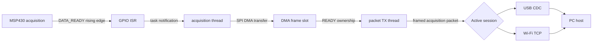
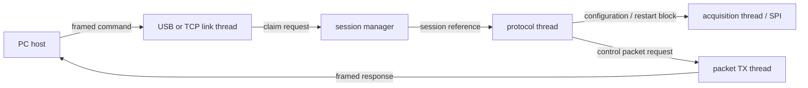

# Firmware architecture

The ESP32 firmware bridges a WULPUS PRO Acquisition PCB to one PC host over
either native USB CDC or Wi-Fi/TCP. Transport selection is dynamic: USB and TCP
listen concurrently, but only one valid protocol session can control the board
at a time.

## Contents

- [Component layout](#component-layout)
- [Application threads](#application-threads)
- [Acquisition data path](#acquisition-data-path)
- [Control path](#control-path)
- [USB and Wi-Fi session switching](#usb-and-wi-fi-session-switching)
- [Session and MSP430 lifecycle](#session-and-msp430-lifecycle)
- [USB power management](#usb-power-management)

## Component layout

| Path | Responsibility |
|---|---|
| `main/app_main.c` | Initialize components and start application threads. |
| `components/bsp` | Initialize the XIAO board and control its status LED. |
| `components/board` | Board GPIO, MSP430 reset, DATA_READY interrupt, SPI DMA, and USB light-sleep lock. |
| `components/frames` | Fixed pool of DMA-capable acquisition buffers. |
| `components/control` | Active session, acquisition state, sticky errors, and diagnostic counters. |
| `components/protocol` | PC protocol headers, commands, validation, and status structures. |
| `components/links` | Common ordered byte-stream interface plus USB and TCP adapters. |
| `components/sock` | TCP socket creation, listening, transfer, and synchronization. |
| `components/threads` | Long-running acquisition, protocol, transport, transmission, and provisioning tasks. |
| `components/provisioner` | Wi-Fi station setup and SoftAP provisioning workflow. |
| `components/persistent_config` | Versioned device-wide boot policy stored in NVS. |
| `components/mdns_manager` | Network discovery for the TCP service. |
| `components/msp430_programmer` | Image staging, validation, boot-time four-wire JTAG programming, and persisted update results/diagnostics. |

Acquisition GPIO/SPI operations stay in `components/board`; application threads
do not manipulate those peripherals directly. The MSP430 programmer owns its
configured TEST and JTAG GPIOs while programming.

## Application threads

| Thread | Default priority | Role |
|---|---:|---|
| `acquisition` | 8 | Sole SPI acquisition owner. Responds to DATA_READY and receives each payload into a DMA frame slot. |
| `protocol` | 6 | Sole reader of the active link. Parses PC commands and orchestrates the MSP430 lifecycle. |
| `usb_link` | 5 | Detects a USB host, finds a valid protocol header, and attempts to claim the session. |
| `tcp_link` | 5 | Starts once, waits for a Wi-Fi connection, then accepts TCP clients and attempts to claim the session. |
| `provisioning` | 5 | Persistent Wi-Fi owner. Applies boot policy, provisions or reconnects, publishes connectivity, and configures power save/TWT. |
| `packet_tx` | 4 | Sole writer to USB or TCP. Serializes control responses and acquisition packets. |

`app_main()` performs initialization and starts these threads. It does not move
acquisition data.

Before normal threads start, `app_main()` checks for a committed MSP430 update
and runs it synchronously. Uploads arrive through the normal protocol task;
commit persists the request and creates a short-lived `msp430_reboot` task to
restart the ESP32 after 250 ms. USB/TCP application commands are unavailable
during the subsequent boot-time programming. Results and JTAG diagnostics are
stored in NVS for retrieval after normal startup. See
[MSP430 updates](msp430_update_guide.md) for the lifecycle and recovery limits.

## Acquisition data path



SPI DMA writes each complete acquisition payload directly into a frame slot.
The payload is not copied between the acquisition and packet-TX threads.

The default frame pool contains 64 slots. At 500 frames/s it holds 128 ms of
data and consumes 51,456 bytes for payload storage, plus small metadata and
allocator overhead. Slots move through these ownership states:

```text
FREE -> SPI -> READY -> TX -> FREE
```

If no free slot becomes available within 100 ms, acquisition stops and the
sticky `ACQ_BUFFER_OVERFLOW` status flag and overflow counter are set. Completed
frames still queued when the session is stopped are released and counted as
discarded frames.

## Control path



The protocol thread is the only active-link reader. The packet-TX thread is the
only writer, preventing control headers and RF payloads from interleaving. It
drains pending control responses before sending another ready acquisition
frame; an in-progress packet is never interrupted.

## USB and Wi-Fi session switching

USB and TCP listeners do not claim ownership merely because a cable is attached
or a socket connects. A listener waits for a valid protocol frame before it
attempts to claim the global session.

The first valid frame wins. A competing transport receives `BUSY`, and it does
not gain access to acquisition data.

To switch transports cleanly:

1. Stop acquisition on the current transport.
2. Send `CLOSE`.
3. Wait for its acknowledgement and allow the ESP32 to return the MSP430 to its
   safe configuration state.
4. Connect with the other transport and send its first command.

The USB cable may remain physically connected when switching to Wi-Fi. An idle
USB connection does not own the protocol session. If the USB application still
has an active session, a TCP client receives `BUSY` until USB closes or fails.

Session references include a generation counter. Queued frames from an older
session are rejected after ownership changes, preventing stale data from being
sent to the new host.

## Session and MSP430 lifecycle

When a transport claims the session, the protocol thread:

1. Suspends optional Wi-Fi TWT behavior.
2. clears stale DATA_READY edges;
3. releases the active-low MSP430 reset;
4. waits 100 ms for MSP430 startup; and
5. begins command processing.

On `CLOSE`, transport failure, or normal cleanup, it stops acquisition, discards
queued session frames, sends the MSP430 restart block, waits for the MSP430 to
return to its configuration-request state, asserts reset, closes the link, and
releases session ownership. Shutdown waits are bounded; timeout and SPI errors
are exposed through runtime status.

## USB power management

The ESP32-C6 USB Serial/JTAG peripheral supplies the native CDC channel. While
a USB host is detected, the USB listener holds an `ESP_PM_NO_LIGHT_SLEEP` lock.
This prevents automatic light sleep from interrupting enumeration or CDC
traffic. The lock is released after physical USB disconnection; protocol
session ownership is independent of this power-management lock.

See [ESP32-to-PC protocol](esp32_pc_protocol.md), [ESP32-to-MSP430 acquisition protocol](msp430_acq_protocol.md),
and [Wi-Fi provisioning](wifi_provisioning_guide.md) for the corresponding wire formats and
startup workflow.
