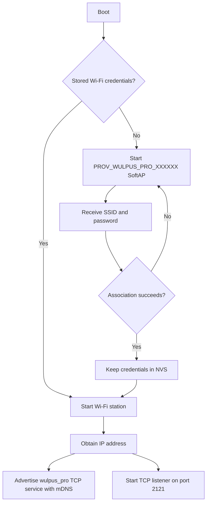

# Wi-Fi provisioning

The firmware uses ESP-IDF network provisioning over a temporary SoftAP. Wi-Fi
credentials are stored in non-volatile storage and reused after reset or power
cycling.

This is the provisioning flow used by the
[WULPUS PRO WiFi host PCB](../../../hw/wulpus_wifi_host_pcb), the primary host
board. Its integrated XIAO ESP32-C6 behaves identically to a standalone XIAO
running this firmware.

Provisioning controls only Wi-Fi setup. It does not own the WULPUS PRO PC
protocol session, and native USB CDC remains available while the board is
waiting for credentials or network association.

## When provisioning starts

At boot, the provisioning thread asks the ESP-IDF provisioning manager whether
station credentials are stored:

- If no credentials exist, the board starts the SoftAP provisioning service.
- If credentials exist, the provisioning manager is deinitialized and the
  board immediately attempts to join the stored network.
- If association is lost later, the station reconnects automatically.

The TCP listener starts only after the station obtains an IP address. The USB
listener starts independently during normal firmware startup.

## Provisioning parameters

| Setting | Current value |
|---|---|
| Scheme | SoftAP |
| SoftAP name | `PROV_WULPUS_PRO_XXXXXX` |
| Name suffix | Last three bytes of the station MAC address, uppercase hexadecimal |
| Provisioning security | ESP-IDF Security 1 |
| Proof of possession | `CONFIG_PROVISIONER_POP`; default `abcd1234` |
| SoftAP service key | None |

Use an ESP-IDF-compatible provisioning client, select the
`PROV_WULPUS_PRO_XXXXXX` device, enter the proof-of-possession value, and provide
the target Wi-Fi SSID and password. The provisioning service validates the
credentials by connecting to the requested access point.

The proof-of-possession default is suitable for development only. Set a unique
value through `CONFIG_PROVISIONER_POP` for deployed devices.

## Boot sequence



The firmware uses maximum-modem Wi-Fi power saving after association. Optional
TWT support is controlled by `CONFIG_PROVISIONER_TWT_ENABLED` and is suspended
while a WULPUS PRO protocol session is active.

## Reprovisioning

When `CONFIG_WP_DOUBLE_RESET` is enabled, resetting the ESP32 twice within
`CONFIG_WP_DOUBLE_RESET_TIMEOUT` requests a provisioning reset. The default
timeout declared by the project is 2000 ms. On the second boot, stored Wi-Fi
provisioning state is cleared and the SoftAP workflow starts again.

Check the generated `sdkconfig` for the firmware being flashed. If it contains:

```text
# CONFIG_WP_DOUBLE_RESET is not set
```

the double-reset trigger is unavailable in that build.

There is currently no ESP-to-PC command that erases saved Wi-Fi credentials.
If double reset is disabled, reprovisioning requires rebuilding with it enabled
or erasing the device's stored NVS/flash through the ESP-IDF tooling. Erasing
flash also removes other persistent data and should be treated as a maintenance
operation.

## USB operation during provisioning

USB CDC can be used even when:

- the device has never been provisioned;
- the configured access point is unavailable;
- the station is reconnecting; or
- the provisioning client is active.

A physical USB connection does not prevent later TCP use. Close the active USB
protocol session before connecting over TCP; see
[Firmware architecture](architecture.md#usb-and-wi-fi-session-switching).

## Troubleshooting

- **No device appears in Wi-Fi discovery:** confirm provisioning completed and
  the PC and ESP32 are on a network that permits mDNS and peer-to-peer TCP.
- **SoftAP does not appear:** credentials may already be stored. Check whether
  the build enables the double-reset trigger.
- **Provisioning repeatedly rejects credentials:** verify the SSID/password and
  ensure the access point is reachable by an ESP32-C6. With
  `CONFIG_PROVISIONER_RESET_ON_FAILURE`, the provisioning state machine resets
  after the configured number of failed attempts.
- **TCP reports `BUSY`:** another transport owns the WULPUS PRO protocol
  session. Close the USB session before retrying TCP.
